## My `VS Code` Setup
---

I personally prefer the following VS Code **extentions**:

- For Viewing Data:
  - Edit csv
    
  - Rainbow CSV
    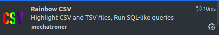
  - CSV to Markdown Table
  - Excel Viewer
    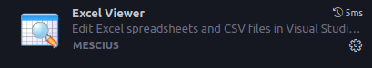
  - JSON Crack
    

- For MarkDown Files:
  - Markdown All in One
    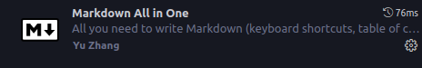
  - Markdown Link Updater
    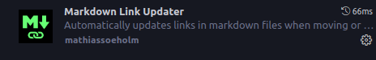
  - Markdown PDF
    
  - Markdown Preview Enhanced
    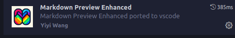
  - HTTP/s and relative linker checker
    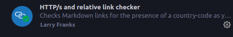
  - view-readme
    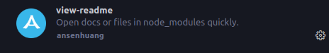
  - CSV to Markdown Table
    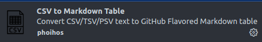

- For PDFs:
  - pdf
    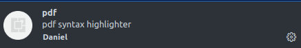
  - PDF Viewer
    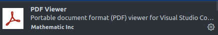
  - vscode-pdf
    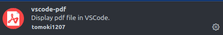
  - Markdown PDF
    

- Color Themes:
  - Blue Black (Blackest With Blue)
    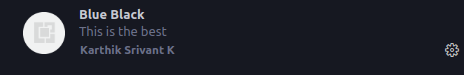
  - Black Ocean
    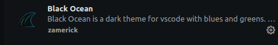
  - Iceberg Theme (by cocopon)
    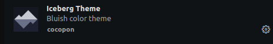
  - Iceberg (by harg)
    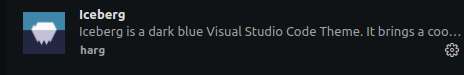
  - GitHub Theme
    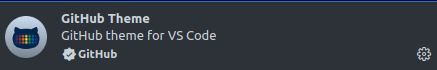
  - Nord
    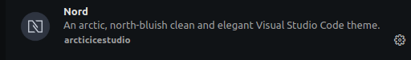
  - Electron Color Theme
    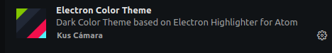
  - The Digital Life
    

- Code Related:
  - WakaTime
    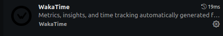
  - Error Lens
    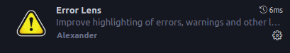
  - TODO Highlight
    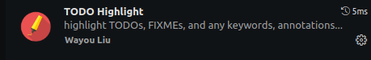
  - Todo Tree
    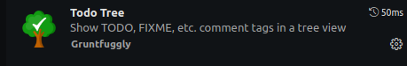
  - In Your Face
    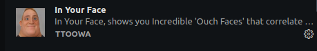
  - Live Server
    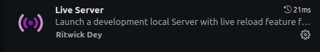
  - Path Intellisense
    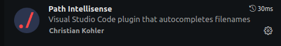
  - Postman
    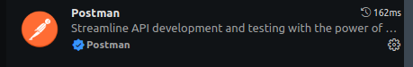

- Others:
  - fzf fuzzy quick open
    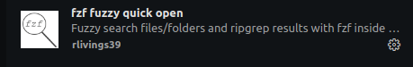
  - WSL
    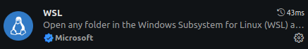
  - Bash Beatify
    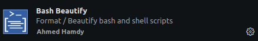

