# My `Android` Setup and Ricing
---

## Blue Icon Pack : LuXBlue (by JustNewDesigns)
---

> Source link: <https://play.google.com/store/apps/details?id=com.jndapp.lux.blue.iconpack>

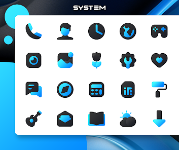
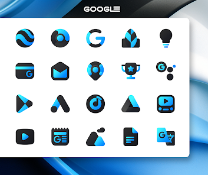
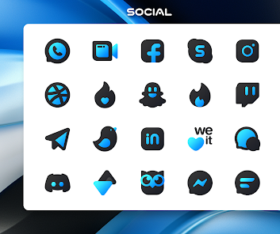
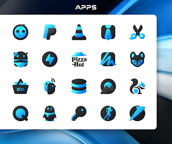
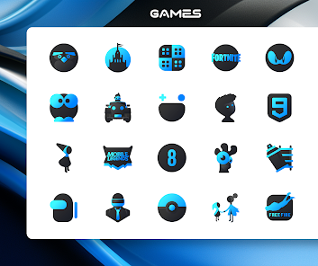
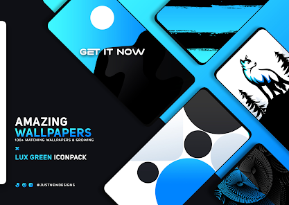
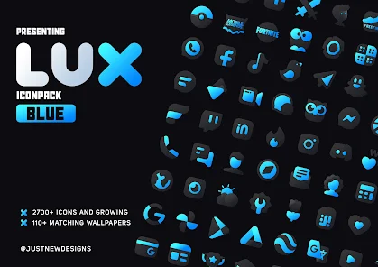

## Shortcut Maker (application)
---

> Source link: <https://play.google.com/store/apps/details?id=rk.android.app.shortcutmaker>

This app makes what is equivalent of a **symbolic link**.

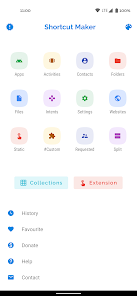
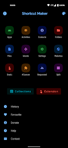
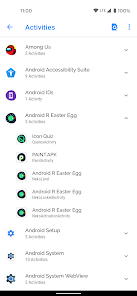
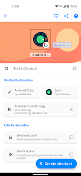
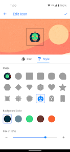
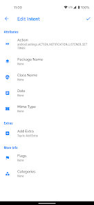
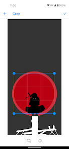
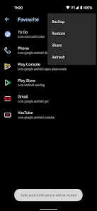

## Vived
---

> Source link: <https://play.google.com/store/apps/details?id=com.virtuslab.vived>

App related to news in IT.

Also, available online, on web: <https://vived.io/>.

